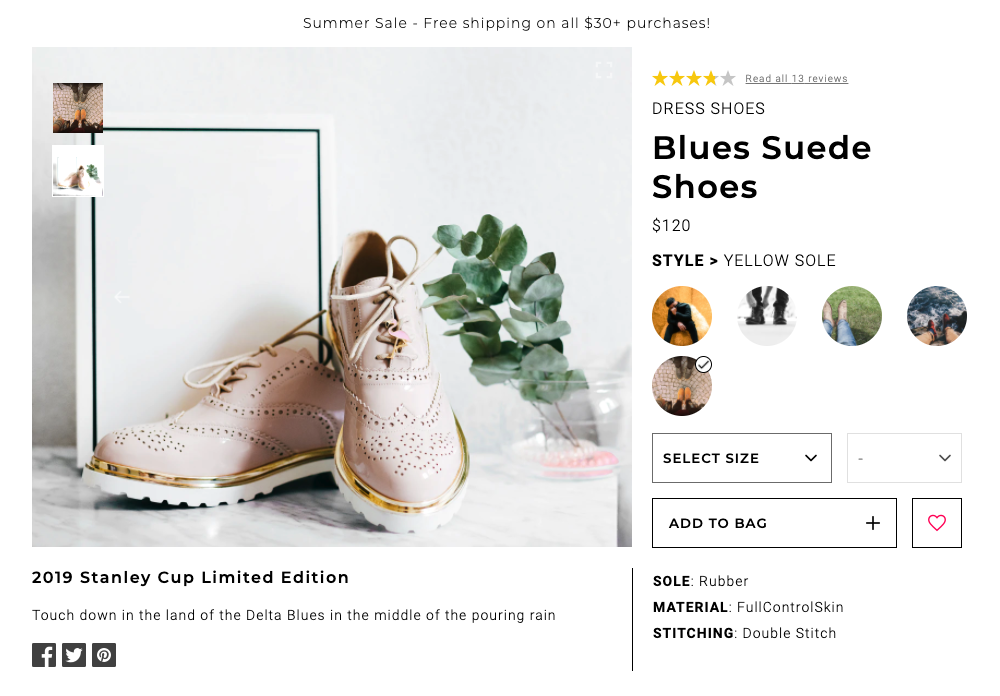

# Blázar - Retail Web Portal

[Live Version](http://agile-ocean-70740.herokuapp.com/)

This client-facing web portal was built out by a team of 3 devs over a span of 2 weeks following a 26 page business requirements document. The primary focus was on the frontend using React (Hooks), Redux for global state management, Express to render data from a headless API, and Sass to create a consistent and maintainable theme across the application.


---

## Table of Contents
1. [Installing Dependencies](#Installing-Dependencies)
2. [Tech Stack](#Tech-Stack)
3. [Optimization](#Optimization)
4. [Components](#Components)
5. [Contributors](#Contributors)

---

## Installing-Dependencies

### Navigate to the root directory and run the following in your terminal:

>*Install dependencies*
```
npm install
```
>*Run webpack build*
```
npm run build
```
>*Start the server*
```
npm start
```
>*If needed, run the following for development mode*
```
npm run dev
```
Open the file `client/dist/index.html` or `http://localhost:5050` in your browser

---

## Tech-Stack
- [React](https://reactjs.org/)
- [Redux](https://redux.js.org/)
- [Node.js](nodejs.org)
- [Express](http://expressjs.com/)
- [Sass](https://sass-lang.com/)

---

## Optimization

*Time to first contentful paint reduced from 5.3s to .6s and time to interactive from 25.7s to 3s*
### Google Lighthouse audit progress details below:

<details>
<summary>Prior Optimizations</summary>
<br>


</details>

<details>
<summary>Post Code minification</summary>
<br>


</details>

<details>
<summary>Post Gzip compression</summary>

<br>


</details>

---

## Components

### Scroll-through Overview


### Product Detail
>The top-most section on the Product Detail page. This component will guide the customer through selecting a specific style and size to add to their cart.



### Related Items & Outfit Creation
>The Related Items section will display two sets of related products. The first set will be a list of products, determined internally, that are related to the product currently being viewed. The second set will be a list, custom created by the user, of products which the user has grouped with the current product into an ‘outfit’.


### Ratings & Reviews
>The Ratings & Reviews section will allow viewing and submission of reviews for the product selected. This component will extend the ability to write, read, and browse through reviews for the current product. All reviews will be saved per product.


---

## Contributors

- [Shelley Chen](https://github.com/shelleychenn)
- [Eric Weiner](https://github.com/Eweiner11)
- [Michael Doudy](https://github.com/mdoudy90)
